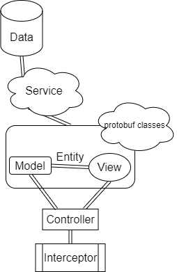
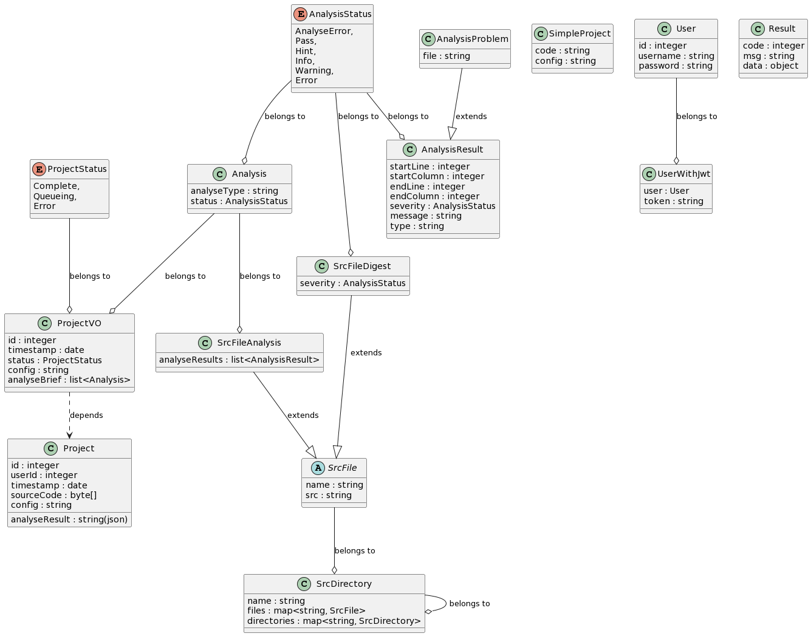

# 1 项目设计

## 1.1 项目需求

基于**Spring Boot**设计微服务后端。

处理前端分析请求，将其转换为算法后端请求；
处理算法后端回传的分析结果，并根据前端查询请求将结果格式化。
对用户信息和分析代码信息进行持久化。
支持分析请求并发和查询请求缓存。

## 1.2 项目框架

项目框架由**MVC**框架拓展而来，共分为五部分。
其中，Data部分负责数据库和缓存库的交互；
Service部分负责数据处理和格式转化；
Model和View统一放在Entity部分，负责定义前后端交互采用的数据格式；
Controller负责定义前后端交互采用的API并调用Service的方法；
Interceptor负责检查用户令牌，实现用户登录和验证功能。

此外，protobuf classes定义了GRPC通信时使用的数据格式，其仅用于与算法后端通信。
它们的格式由proto文件定义，Java代码是自动生成的。

### 1.2.1 层级关系

**Data**
- ProjectMapper 代码包信息持久化（代码包归用户所有，支持联查）
- UserMapper 用户信息持久化

**Service**
- UserService 用户相关服务
- PlaygroundService 单文件代码测试服务
- ProjectService tar.gz代码包测试服务

**Entity**
- Result 统一View格式
- 用户
  - User 用户信息
  - UserWithJwt 用户与其认证信息
- 代码包
  - Project 代码包信息（包括配置文件）
  - ProjectStatus 代码包分析状态枚举
  - SimpleProject 单文件代码信息
  - ProjectVO 代码包信息简报
- 源文件
  - SrcFile 源文件抽象类
  - SrcFileAnalysis 源文件分析结果
  - SrcFileDigest 源文件分析结果简报
  - SrcDirectory 源目录信息（递归的）
- 分析信息
  - AnalysisResult 分析结果单元（体现为一块带分析信息的代码块的起始行列和结束行列）
  - Analysis 分析结果总结（最严重的汇报）
  - AnalysisStatus 分析结果类型枚举
  - AnalysisProblem 分析结果问题汇报（将分析结果单元与源文件挂钩）

**Controller**
- UserController 用户相关接口
- PlaygroundController 单文件代码测试接口
- ProjectController tar.gz代码包测试接口

**Interceptor**
- UserInterceptor 用户令牌拦截器（检查用户令牌）

**其它**
- JwtUtils 生成和解析用户令牌
- TarGzUtils 压缩和解压缩tar.gz代码包
- config classes 配置类

### 1.2.2 类图

实体类成员与json格式详见项目使用说明(usage.md)或**swagger-ui**(在端口8080)。

